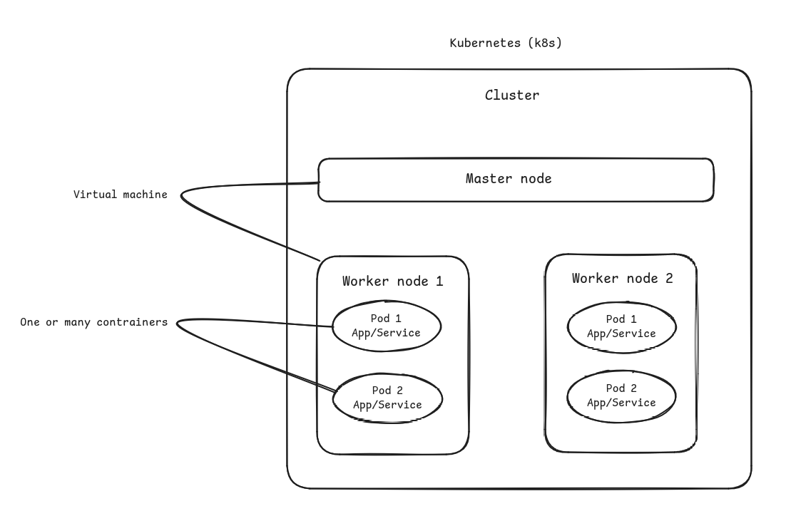

# Inception of things

This project is an introduction of `Kubernetes (K8s)`.  It's a software to handle containers, their lifecycle.

## [K8s](https://blog.stephane-robert.info/docs/conteneurs/orchestrateurs/kubernetes/introduction/)'s organisation:

### [Master and worker](./P1/README.md)

### [Pods](https://kubernetes.io/fr/docs/concepts/workloads/pods/pod-overview/)
The pod is the smallest kubernetes unit, it's an `environment`, a single instance of an application/service. So to create `replicas` many pods mus` used.  
Each pod is `isolated`, have an IP address, a namespace and a volume.  
All external communications require configuration. So each containers in pod can communicate.  
